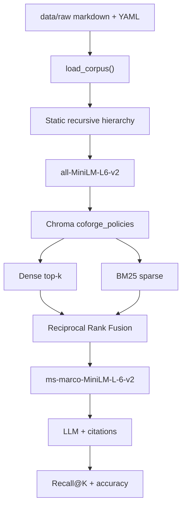

# Policy RAG architecture

Status: Corpus, hierarchical chunking, the dense retrieve loop (MiniLM +
Chroma cosine), and hybrid search (BM25 + Reciprocal Rank Fusion) are in
production code. Cross-encoder reranking stays blocked until the hybrid tests
are green.

Enterprise policy assistant over **versioned Coforge investor policies**, with a
**known data-quality fixture** (stale Human Rights v1) so retrieval can surface
the wrong policy version — a data incident, not a model failure.

```
data/raw/*.md
    → load_corpus()          # done
    → chunk_document()       # done
    → embed MiniLM           # done
    → ChromaDB persist       # done
    → dense retrieve         # minimal loop (gate, green)
    → BM25 + RRF             # hybrid search
    → cross-encoder rerank   # next capability
    → generate + cite
    → GitHub Actions CI
```

**Gate:** `tests/test_minimal_loop.py` is green. Cross-encoder rerank and CI stay off until `tests/test_hybrid.py` is green.

## 1. Pipeline slice

The block above is the production path. Later phases add hybrid fusion, reranking, generation with citations, eval, and CI.

## 2. Corpus facts (measured, not assumed)

| File | Chars | Words | `##` sections | Role |
|------|------:|------:|-------------:|------|
| `human_rights_policy_v2.md` | 6,703 | 983 | 13 | Current Human Rights (FY 2025) |
| `posh_policy.md` | 4,288 | 657 | 9 | POSH / SHRC |
| `nomination_remuneration_policy.md` | 3,194 | 468 | 8 | Director tenure / pay |
| `supplier_code_of_conduct.md` | 3,168 | 411 | 5 | Supplier labour / leave |
| `whistleblower_policy.md` | 3,022 | 414 | 5 | Vigil mechanism |
| `csr_esg_policy.md` | 2,777 | 388 | 5 | CSR scope |
| `ehs_policy.md` | 2,472 | 331 | 5 | Net zero 2040 |
| `modern_slavery_statement.md` | 2,430 | 344 | 6 | UK MSA training |
| `board_diversity_policy.md` | 2,368 | 337 | 5 | Board composition |
| `human_rights_policy_v1.md` | 1,675 | 246 | 6 | **Stale v1 data-quality fixture** |
| **Total** | **32,097** | | | 10 documents |

Paragraphs in the corpus: **179**. Median length **112** chars. 90th percentile **391**. Longest **1,123**.

These numbers drive chunk size. A 300-char window would cut most of the long POSH / Human Rights paragraphs in half. A 1,000-char window would bury the stale “15 days Privilege Leave” clause inside a large Human Rights v1/v2 vector.

## 3. Chunking strategy (locked)

**Method:** static recursive hierarchical typing.

“Static” means the ladder is a fixed ordered list of structural types — not an embedding- or LLM-based semantic splitter. “Recursive” means a unit that still exceeds the size budget is handed to the next finer type. “Typing” means every emitted chunk is labeled with the level that produced it (`document` → `section` → `subsection` → `paragraph` → `sentence` → `window`).

```
document
  └─ section          ## heading   (siblings never merged)
       └─ subsection  ### heading  (siblings never merged)
            └─ paragraph          (greedy pack until 500)
                 └─ list          markdown `-` / `*` items (greedy pack)
                      └─ sentence
                           └─ window   500 / 100 overlap, last resort
```

Rules:

1. If the whole document is ≤ 500 characters, emit one `document` chunk.
2. Split on `## ` first. Each H2 is its own unit. **Do not pack two sections together** — citations need a real section name.
3. If a section is still too large, drop to `### `, then blank-line paragraphs, then sentence boundaries.
4. Adjacent paragraphs/sentences **do** pack greedily until they would exceed 500 characters (avoids a pile of 112-char embedding orphans; corpus paragraph median is 112).
5. Character windows with 100-char overlap run only when no structural separator remains.
6. Child chunks inherit a heading breadcrumb (`## Fair Wages and Remuneration` prefixed) so MiniLM still sees the section title.
7. Copy parent YAML metadata onto every chunk. Override `section` with the innermost heading when present.

```
CHUNK_SIZE    = 500   # budget, not a saw
CHUNK_OVERLAP = 100   # windows only
EMBED_MODEL   = sentence-transformers/all-MiniLM-L6-v2
COLLECTION    = coforge_policies
DISTANCE      = cosine
```

### Why this instead of a flat 500/100 slide, 300-char windows, or semantic chunking

| Choice | Why |
|--------|-----|
| Typed hierarchy | A POSH complaint procedure stays a `section`; a leftover long clause becomes `paragraph` or `window`. Later debug can filter by `chunk_type`. |
| 500-char budget | Just above paragraph p90 (391). Emails and day counts stay intact. ~100–125 MiniLM tokens. |
| Pack paragraphs, never headings | Dense retrieval hates 112-char fragments; citations hate merged “Purpose+Vision” blobs. |
| 100-char overlap on windows only | Structural splits already keep sentences together; overlap is for the last-resort saw. |
| Not semantic / LLM chunking | Non-deterministic, extra model, overkill for 32 KB of markdown. |
| Not one-chunk-per-file | Human Rights v2 is 6.7 KB and would dilute the grievance email. |

### What each chunk stores

```text
id:        human_rights_policy_v1.md::fair-wages-and-remuneration::0
text:      <chunk body>
metadata:
  doc_name:     Human Rights Policy
  section:      Fair Wages and Remuneration
  version:      1.0
  status:       legacy            # current | legacy
  source_url:   synthetic-legacy-conflict | https://investors.coforge.com/...
  source_file:  human_rights_policy_v1.md
  chunk_type:   section | paragraph | ...
  chunk_index:  0
```

`status` and `version` must survive into Chroma so incident review can prove a **legacy** Human Rights hit, and so answers can cite sources.

## 4. Embeddings and store (done)

| Piece | Decision | Why |
|-------|----------|-----|
| Model | `all-MiniLM-L6-v2` (384-d) | CPU-friendly default; cosine matches Chroma; same MiniLM family as the later reranker. |
| Store | Chroma persistent client at `chroma/` | Gitignored, rebuildable from `data/raw`. |
| Metric | Cosine | MiniLM embeddings are L2-normalized; cosine ≡ inner product. |
| Query k | 5 in the minimal loop | Enough to surface both Human Rights versions plus a distractor (Supplier CoC also mentions leave). |

The **minimal retrieve loop** does dense retrieval only. Hybrid search adds BM25 and RRF on top of that loop.

## 4.1 Hybrid search (done)

Dense MiniLM (`PolicyIndex.search`) and in-memory Okapi BM25 each return a best-first list of depth `max(k, HYBRID_CANDIDATE_K)` (candidate depth 20, final `RETRIEVE_K` 5). Reciprocal Rank Fusion scores every chunk as:

```
score(d) = Σ 1 / (RRF_K + rank_list(d))
```

`RRF_K` is 60. Rank is 1-based. A chunk absent from a list adds nothing for that list. `status=legacy` is still not a filter.

BM25 uses `k1=1.5` and `b=0.75`. Tokens are lowercase alphanumeric runs, with no stopword list, so `15`, `days`, and `not` stay available. The postings live in memory and are rebuilt from the persisted Chroma rows: the corpus is about 32 KB, and a second on-disk index would only drift from the vectors.

### Why RRF instead of adding raw scores

Cosine distance for L2-normalized MiniLM vectors sits in `[0, 2]`. BM25 is an idf-weighted sum with no shared ceiling. Those numbers cannot be added.

Worked example with `RRF_K=60`. Document A is dense rank 1 (similarity 0.95, so distance 0.05) and BM25 rank 2 (score 1.0). Document B is dense rank 4 (similarity 0.10) and BM25 rank 1 (score 30).

| Fusion | A | B | Winner |
|--------|--:|--:|--------|
| `(1 - distance) + BM25` | 0.95 + 1 = 1.95 | 0.10 + 30 = 30.1 | B, because the lexical magnitude swamps the dense hit |
| Min-max each list, then add | Depends on whichever other candidates happen to be in the list; the worst hit is forced to 0 and the best to 1 | Same | Unstable across queries |
| RRF | 1/61 + 1/62 ≈ 0.0325 | 1/64 + 1/61 ≈ 0.0320 | A, because both retrievers rank it near the top |

`RRF_K=60` keeps rank 1 and rank 2 close (`1/61` vs `1/62`). A bare `1/rank` would let a single first place dominate agreement between the two lists.

## 5. End-to-end pipeline



| Phase | Capability | Status |
|-------|------------|--------|
| 1 | Corpus + stale Human Rights v1 | Done |
| 2 | Hierarchical chunk + MiniLM + Chroma + `test_minimal_loop.py` | Done |
| 3 | Hybrid dense + BM25, RRF | Done |
| 4 | Cross-encoder rerank (`cross-encoder/ms-marco-MiniLM-L-6-v2`) | Next |
| 5 | 8+ queries, Recall@K, accuracy | After retrieve works |
| 6 | Two-question debug of stale policy | After eval harness |
| 7 | Cite doc / section / version | Metadata already on chunks |
| 8 | GitHub Actions | Last |

## 6. Stale-policy fixture (do not drop at ingest)

Query: *How many Privilege Leave / PTO days do I get?*

- Human Rights **v1 (legacy)** contains **15 days**, use-it-or-lose-it, `hr.helpdesk@niit-tech.com`.
- Human Rights **v2 (current)** does **not** publish a day count; complaints go to `All.HR@coforge.com`.
- Supplier Code of Conduct mentions leave for **suppliers**, not Coforge employees.

**Index both versions.** Filtering `status=legacy` hides the data-quality incident the eval harness must surface.

Two-question debug (later):

1. Did we retrieve the right documents? (v1 ranking is a corpus/index issue, not a model issue.)
2. Did the generator use the right one? (Answering 15 days means it trusted a retired policy.)

## 7. Modules

```
src/rag_lab/
  corpus.py        # exists
  chunking.py      # static recursive hierarchical types (done)
  embeddings.py    # MiniLM encode (done)
  index.py         # Chroma upsert / query (done)
  bm25.py          # Okapi BM25 (done)
  hybrid.py        # Reciprocal Rank Fusion (done)
  config.py        # CHUNK_SIZE, RRF_K, BM25_K1, HYBRID_CANDIDATE_K
tests/
  test_chunking.py
  test_minimal_loop.py   # retrieve-loop gate
  test_hybrid.py         # dense + BM25 + RRF
```

Do not add a cross-encoder, an LLM client, or CI in the hybrid-search change.

## 8. Evidence to capture

1. `pytest -v tests/test_corpus.py` (already green).
2. Chunk stats (count, max length ≤ 500).
3. `pytest -v tests/test_minimal_loop.py` plus a PTO query that returns Human Rights v1.
4. `pytest -v tests/test_hybrid.py` — RRF order, BM25 rank of the legacy 15-day clause, and the fused PTO query.
