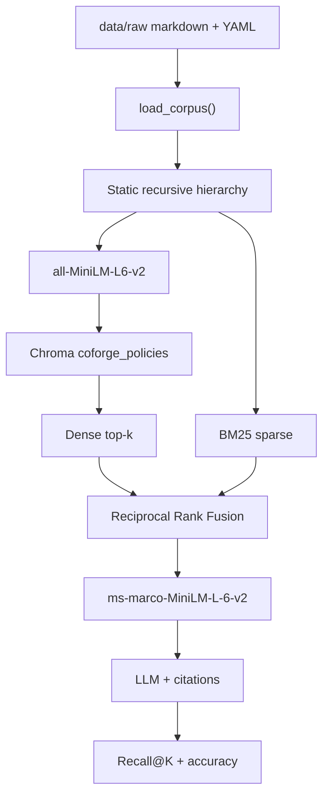

# RAG Lab Architecture

Status: Part 1 complete. This document freezes the Part 2 design before code.
Corpus measured 2026-09-25 from `data/raw/*.md`.

## 1. What we are building

A retrieval-augmented generation pipeline over **public Coforge investor policies**, with a **planted data-quality defect** so we can later prove the system retrieved the wrong version of Human Rights Policy.

```
data/raw/*.md
    → load_corpus()          # Part 1  (done)
    → chunk_document()       # Part 2  (next)
    → embed MiniLM           # Part 2  (next)
    → ChromaDB persist       # Part 2  (next)
    → dense retrieve         # Part 2  (minimal loop)
    → BM25 + RRF             # Part 3  (blocked until test_minimal_loop.py)
    → cross-encoder rerank   # Part 4
    → generate + cite        # Part 5–7
    → GitHub Actions         # Part 8
```

**Gate:** hybrid search, reranking, and CI stay off until `tests/test_minimal_loop.py` is green (load → chunk → embed → store → retrieve).

## 2. Corpus facts (measured, not assumed)

| File | Chars | Words | `##` sections | Role |
|------|------:|------:|-------------:|------|
| `human_rights_policy_v2.md` | 6,703 | 983 | 13 | Current Human Rights (FY 2025) |
| `posh_policy.md` | 4,288 | 657 | 9 | POSH / SHRC |
| `nomination_remuneration_policy.md` | 3,194 | 468 | 8 | Director tenure / pay |
| `supplier_code_of_conduct.md` | 3,168 | 411 | 5 | Supplier labour / leave |
| `whistleblower_policy.md` | 3,022 | 414 | 5 | Vigil mechanism |
| `csr_esg_policy.md` | 2,777 | 388 | 5 | CSR scope |
| `ehs_policy.md` | 2,472 | 331 | 5 | Net zero 2040 |
| `modern_slavery_statement.md` | 2,430 | 344 | 6 | UK MSA training |
| `board_diversity_policy.md` | 2,368 | 337 | 5 | Board composition |
| `human_rights_policy_v1.md` | 1,675 | 246 | 6 | **Legacy planted defect** |
| **Total** | **32,097** | | | 10 documents |

Paragraphs in the corpus: **179**. Median length **112** chars. 90th percentile **391**. Longest **1,123**.

These numbers drive chunk size. A 300-char window would cut most of the long POSH / Human Rights paragraphs in half. A 1,000-char window would bury the planted “15 days Privilege Leave” clause inside a large Human Rights v1/v2 vector.

## 3. Chunking strategy (locked for Part 2)

**Method:** static recursive hierarchical typing.

“Static” means the ladder is a fixed ordered list of structural types — not an embedding- or LLM-based semantic splitter. “Recursive” means a unit that still exceeds the size budget is handed to the next finer type. “Typing” means every emitted chunk is labeled with the level that produced it (`document` → `section` → `subsection` → `paragraph` → `sentence` → `window`).

```
document
  └─ section          ## heading   (siblings never merged)
       └─ subsection  ### heading  (siblings never merged)
            └─ paragraph          (greedy pack until 500)
                 └─ list          markdown `-` / `*` items (greedy pack)
                      └─ sentence
                           └─ window   500 / 100 overlap, last resort
```

Rules:

1. If the whole document is ≤ 500 characters, emit one `document` chunk.
2. Split on `## ` first. Each H2 is its own unit. **Do not pack two sections together** — Part 7 needs a real section name.
3. If a section is still too large, drop to `### `, then blank-line paragraphs, then sentence boundaries.
4. Adjacent paragraphs/sentences **do** pack greedily until they would exceed 500 characters (avoids a pile of 112-char embedding orphans; corpus paragraph median is 112).
5. Character windows with 100-char overlap run only when no structural separator remains.
6. Child chunks inherit a heading breadcrumb (`## Fair Wages and Remuneration` prefixed) so MiniLM still sees the section title.
7. Copy parent YAML metadata onto every chunk. Override `section` with the innermost heading when present.

```
CHUNK_SIZE    = 500   # budget, not a saw
CHUNK_OVERLAP = 100   # windows only
EMBED_MODEL   = sentence-transformers/all-MiniLM-L6-v2
COLLECTION    = coforge_policies
DISTANCE      = cosine
```

### Why this instead of a flat 500/100 slide, 300-char windows, or semantic chunking

| Choice | Why |
|--------|-----|
| Typed hierarchy | A POSH complaint procedure stays a `section`; a leftover long clause becomes `paragraph` or `window`. Later debug can filter by `chunk_type`. |
| 500-char budget | Just above paragraph p90 (391). Emails and day counts stay intact. ~100–125 MiniLM tokens. |
| Pack paragraphs, never headings | Dense retrieval hates 112-char fragments; citations hate merged “Purpose+Vision” blobs. |
| 100-char overlap on windows only | Structural splits already keep sentences together; overlap is for the last-resort saw. |
| Not semantic / LLM chunking | Non-deterministic, extra model, overkill for 32 KB of markdown. |
| Not one-chunk-per-file | Human Rights v2 is 6.7 KB and would dilute the grievance email. |

### What each chunk stores

```text
id:        human_rights_policy_v1.md::fair-wages-and-remuneration::0
text:      <chunk body>
metadata:
  doc_name:     Human Rights Policy
  section:      Fair Wages and Remuneration
  version:      1.0
  status:       legacy            # current | legacy
  source_url:   lab-planted-defect | https://investors.coforge.com/...
  source_file:  human_rights_policy_v1.md
  chunk_type:   section | paragraph | ...
  chunk_index:  0
```

`status` and `version` must survive into Chroma. That is how Part 6 proves we retrieved the **legacy** Human Rights policy, and how Part 7 cites sources.

## 4. Embeddings and store (Part 2, after the splitter)

| Piece | Decision | Why |
|-------|----------|-----|
| Model | `all-MiniLM-L6-v2` (384-d) | Lab-standard, CPU-friendly, cosine space matches Chroma default. Same family as the later MiniLM reranker. |
| Store | Chroma persistent client at `chroma/` | Gitignored, rebuildable from `data/raw`. |
| Metric | Cosine | MiniLM embeddings are L2-normalized; cosine ≡ inner product. |
| Query k | 5 in the minimal loop | Enough to surface both Human Rights versions plus a distractor (Supplier CoC also mentions leave). |

The **minimal loop** does dense retrieval only. BM25 and RRF wait for Part 3.

## 5. End-to-end pipeline (all parts)



| Part | Module | Status |
|------|--------|--------|
| 1 | Corpus + planted Human Rights v1 | Done |
| 2 | Chunk (hierarchical) + MiniLM + Chroma + `test_minimal_loop.py` | Chunker done; embed/index next |
| 3 | Hybrid dense + BM25, RRF | Blocked on Part 2 test |
| 4 | Cross-encoder rerank | After Part 3 |
| 5 | 8+ queries, Recall@K, accuracy | After retrieve works |
| 6 | Two-question debug of planted defect | After eval harness |
| 7 | Cite doc / section / version | Metadata already on chunks |
| 8 | GitHub Actions | Last |

## 6. Planted defect path (do not “fix” in Part 2)

Query: *How many Privilege Leave / PTO days do I get?*

- Human Rights **v1 (legacy)** contains **15 days**, use-it-or-lose-it, `hr.helpdesk@niit-tech.com`.
- Human Rights **v2 (current)** does **not** publish a day count; complaints go to `All.HR@coforge.com`.
- Supplier Code of Conduct mentions leave for **suppliers**, not Coforge employees.

Part 2 **must index both versions**. Filtering `status=legacy` would hide the defect the lab grades in Part 6.

Two-question debug (Part 6, not now):

1. Did we retrieve the right documents? (v1 should rank; that is a data bug, not a model bug.)
2. Did the generator use the right one? (If it answers 15 days, it trusted a retired policy.)

## 7. Planned modules (implement only after this doc)

```
src/rag_lab/
  corpus.py        # exists
  chunking.py      # static recursive hierarchical types (done)
  embeddings.py    # next: MiniLM encode
  index.py         # next: Chroma upsert / query
  config.py        # add CHUNK_SIZE, CHUNK_OVERLAP, EMBED_MODEL
tests/
  test_chunking.py
  test_minimal_loop.py   # Part 2 gate
```

Do not add BM25, RRF, a reranker, or an LLM client in the same change.

## 8. Screenshot milestones

1. `pytest -v tests/test_corpus.py` (Part 1 — already green).
2. Chunk stats printed from a small script (count of chunks, max length ≤ 500).
3. `pytest -v tests/test_minimal_loop.py` passing, plus a sample query that returns Human Rights v1 for a PTO question.
