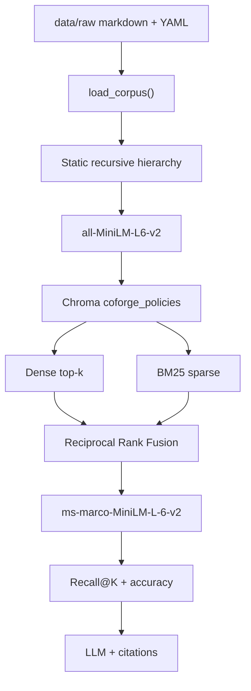

# Policy RAG architecture

Status: Corpus, hierarchical chunking, the dense retrieve loop (MiniLM +
Chroma cosine), hybrid search (BM25 + Reciprocal Rank Fusion), cross-encoder
reranking, and the evaluation harness are in production code. Incident
diagnosis stays blocked until the eval tests are green.

Enterprise policy assistant over **versioned Coforge investor policies**, with a
**known data-quality fixture** (stale Human Rights v1) so retrieval can surface
the wrong policy version — a data incident, not a model failure.

```
data/raw/*.md
    → load_corpus()          # done
    → chunk_document()       # done
    → embed MiniLM           # done
    → ChromaDB persist       # done
    → dense retrieve         # minimal loop (gate, green)
    → BM25 + RRF             # hybrid search
    → cross-encoder rerank   # fused top-20 rescored, top-5 returned
    → eval harness           # Recall@K and answer accuracy, K = 5
    → 2-question diagnosis   # next capability
    → generate + cite
    → GitHub Actions CI
```

**Gate:** `tests/test_minimal_loop.py`, `tests/test_hybrid.py`, and `tests/test_rerank.py` are green. Incident diagnosis stays off until `tests/test_eval.py` is green.

## 1. Pipeline slice

The block above is the production path. Later phases add incident diagnosis, generation with citations, and CI.

## 2. Corpus facts (measured, not assumed)

Word counts are whitespace tokens of the markdown body (frontmatter excluded).
Source-document compliance, preprocessing, and gold-span uniqueness live in
[docs/corpus.md](corpus.md).

| File | Chars | Words | `##` sections | Role |
|------|------:|------:|-------------:|------|
| `whistleblower_policy.md` | 5,186 | 737 | 7 | **primary** (vigil mechanism) |
| `human_rights_policy_v2.md` | 4,734 | 688 | 13 | **primary** (current Human Rights FY 2025) |
| `posh_policy.md` | 4,288 | 657 | 9 | **primary** (POSH / SHRC) |
| `ehs_policy.md` | 4,636 | 596 | 7 | **primary** (net zero 2040) |
| `nomination_remuneration_policy.md` | 3,194 | 468 | 8 | supplemental (Director tenure / pay) |
| `supplier_code_of_conduct.md` | 3,168 | 411 | 5 | supplemental (supplier labour / leave) |
| `csr_esg_policy.md` | 2,777 | 388 | 5 | supplemental (CSR scope) |
| `modern_slavery_statement.md` | 2,430 | 344 | 6 | supplemental (UK MSA training) |
| `board_diversity_policy.md` | 2,368 | 337 | 5 | supplemental (Board composition) |
| `human_rights_policy_v1.md` | 1,677 | 246 | 6 | **fixture** (stale v1 PTO conflict) |
| **Total** | **34,458** | | | 10 documents |

Primary assignment set: four current policies in **500–800 words**. Supplemental
investor PDFs stay indexed because eval still binds gold from them. Human Rights
v1 is not length-gated.

Paragraphs in the corpus: **188**. Median length **112** chars. 90th percentile **411**. Longest **1,424**.

These numbers drive chunk size. A 300-char window would cut most of the long POSH / Human Rights paragraphs in half. A 1,000-char window would bury the stale “15 days Privilege Leave” clause inside a large Human Rights v1/v2 vector.

## 3. Chunking strategy (locked)

**Method:** static recursive hierarchical typing.

“Static” means the ladder is a fixed ordered list of structural types — not an embedding- or LLM-based semantic splitter. “Recursive” means a unit that still exceeds the size budget is handed to the next finer type. “Typing” means every emitted chunk is labeled with the level that produced it (`document` → `section` → `subsection` → `paragraph` → `sentence` → `window`).

```
document
  └─ section          ## heading   (siblings never merged)
       └─ subsection  ### heading  (siblings never merged)
            └─ paragraph          (greedy pack until 500)
                 └─ list          markdown `-` / `*` items (greedy pack)
                      └─ sentence
                           └─ window   500 / 100 overlap, last resort
```

Rules:

1. If the whole document is ≤ 500 characters, emit one `document` chunk.
2. Split on `## ` first. Each H2 is its own unit. **Do not pack two sections together** — citations need a real section name.
3. If a section is still too large, drop to `### `, then blank-line paragraphs, then sentence boundaries.
4. Adjacent paragraphs/sentences **do** pack greedily until they would exceed 500 characters (avoids a pile of 112-char embedding orphans; corpus paragraph median is 112).
5. Character windows with 100-char overlap run only when no structural separator remains.
6. Child chunks inherit a heading breadcrumb (`## Fair Wages and Remuneration` prefixed) so MiniLM still sees the section title.
7. Copy parent YAML metadata onto every chunk. Override `section` with the innermost heading when present.

```
CHUNK_SIZE    = 500   # budget, not a saw
CHUNK_OVERLAP = 100   # windows only
EMBED_MODEL   = sentence-transformers/all-MiniLM-L6-v2
COLLECTION    = coforge_policies
DISTANCE      = cosine
```

### Why this instead of a flat 500/100 slide, 300-char windows, or semantic chunking

| Choice | Why |
|--------|-----|
| Typed hierarchy | A POSH complaint procedure stays a `section`; a leftover long clause becomes `paragraph` or `window`. Later debug can filter by `chunk_type`. |
| 500-char budget | Just above paragraph p90 (411). Emails and day counts stay intact. ~100–125 MiniLM tokens. |
| Pack paragraphs, never headings | Dense retrieval hates 112-char fragments; citations hate merged “Purpose+Vision” blobs. |
| 100-char overlap on windows only | Structural splits already keep sentences together; overlap is for the last-resort saw. |
| Not semantic / LLM chunking | Non-deterministic, extra model, overkill for 34 KB of markdown. |
| Not one-chunk-per-file | Human Rights v2 is 4.7 KB and would dilute the grievance email. |

### What each chunk stores

```text
id:        human_rights_policy_v1.md::fair-wages-and-remuneration::0
text:      <chunk body>
metadata:
  doc_name:     Human Rights Policy
  section:      Fair Wages and Remuneration
  version:      1.0
  status:       legacy            # current | legacy
  source_url:   synthetic-legacy-conflict | https://investors.coforge.com/...
  role:         primary | supplemental | fixture
  source_file:  human_rights_policy_v1.md
  chunk_type:   section | paragraph | ...
  chunk_index:  0
```

`status` and `version` must survive into Chroma so incident review can prove a **legacy** Human Rights hit, and so answers can cite sources.

## 4. Embeddings and store (done)

| Piece | Decision | Why |
|-------|----------|-----|
| Model | `all-MiniLM-L6-v2` (384-d) | CPU-friendly default; cosine matches Chroma; same MiniLM family as the later reranker. |
| Store | Chroma persistent client at `chroma/` | Gitignored, rebuildable from `data/raw`. |
| Metric | Cosine | MiniLM embeddings are L2-normalized; cosine ≡ inner product. |
| Query k | 5 in the minimal loop | Enough to surface both Human Rights versions plus a distractor (Supplier CoC also mentions leave). |

The **minimal retrieve loop** does dense retrieval only. Hybrid search adds BM25 and RRF on top of that loop.

## 4.1 Hybrid search (done)

Dense MiniLM (`PolicyIndex.search`) and in-memory Okapi BM25 each return a best-first list of depth `max(k, HYBRID_CANDIDATE_K)` (candidate depth 20, final `RETRIEVE_K` 5). Reciprocal Rank Fusion scores every chunk as:

```
score(d) = Σ 1 / (RRF_K + rank_list(d))
```

`RRF_K` is 60. Rank is 1-based. A chunk absent from a list adds nothing for that list. `status=legacy` is still not a filter.

BM25 uses `k1=1.5` and `b=0.75`. Tokens are lowercase alphanumeric runs, with no stopword list, so `15`, `days`, and `not` stay available. The postings live in memory and are rebuilt from the persisted Chroma rows: the corpus is about 34 KB, and a second on-disk index would only drift from the vectors.

### Why RRF instead of adding raw scores

Cosine distance for L2-normalized MiniLM vectors sits in `[0, 2]`. BM25 is an idf-weighted sum with no shared ceiling. Those numbers cannot be added.

Worked example with `RRF_K=60`. Document A is dense rank 1 (similarity 0.95, so distance 0.05) and BM25 rank 2 (score 1.0). Document B is dense rank 4 (similarity 0.10) and BM25 rank 1 (score 30).

| Fusion | A | B | Winner |
|--------|--:|--:|--------|
| `(1 - distance) + BM25` | 0.95 + 1 = 1.95 | 0.10 + 30 = 30.1 | B, because the lexical magnitude swamps the dense hit |
| Min-max each list, then add | Depends on whichever other candidates happen to be in the list; the worst hit is forced to 0 and the best to 1 | Same | Unstable across queries |
| RRF | 1/61 + 1/62 ≈ 0.0325 | 1/64 + 1/61 ≈ 0.0320 | A, because both retrievers rank it near the top |

`RRF_K=60` keeps rank 1 and rank 2 close (`1/61` vs `1/62`). A bare `1/rank` would let a single first place dominate agreement between the two lists.

## 4.2 Cross-encoder rerank (done)

`RerankingRetriever` takes the fused list from hybrid search, scores each query–chunk pair with `cross-encoder/ms-marco-MiniLM-L-6-v2`, and sorts by that score.

| Knob | Value | Role |
|------|------:|------|
| `RERANK_MODEL` | `cross-encoder/ms-marco-MiniLM-L-6-v2` | Pair scorer. One relevance score per (query, chunk). Same MiniLM family as the bi-encoder, different checkpoint: the bi-encoder never sees the pair together. |
| `RERANK_CANDIDATE_K` | 20 | Fused hits that are rescored. Matches `HYBRID_CANDIDATE_K`, the pool fusion already kept. |
| `RETRIEVE_K` | 5 | Hits returned after the sort. Same answer window as dense and hybrid search. |
| `RERANK_BATCH_SIZE` | 32 | One CPU batch covers the default pool of 20. |

Twenty fused hits go into the cross-encoder. Five come out.

The 20 are the fusion pool. Each retriever already returned a list of depth 20, and RRF kept the best 20 of that union. The cross-encoder's job is to reorder that pool using the query and the chunk text together. A chunk at fused rank 6 can be the passage that contains the answer; rescoring the pool lets it move into the five that callers see. Rescoring only those five would shuffle a list fusion had already truncated. Rescoring all ~105 chunks would run the transformer over passages both MiniLM and BM25 already ranked below the fusion cutoff. Twenty pairs fit in one CPU batch.

The returned window stays 5 so the eval harness measures Recall@K at the same K the caller receives. The other 15 scores exist only to order that window. A caller who passes a larger `k` rescores `max(k, 20)` and receives `k`.

The model score replaces the order. It is not added to `rrf_score`. RRF values sit near 0.03; an MS MARCO score is often several units wide, so a sum would make the logit the whole decision. Scores are not min-max scaled inside the batch either: that would pin the worst pair to 0 whenever the pool changes. `status=legacy` is still not a filter. Every fused hit is scored, then the list is cut.

## 4.3 Evaluation harness (done)

`evaluate` runs the production query set through `RerankingRetriever` and records two checks. They are not folded into one score.

| Check | What it measures | K / row |
|-------|------------------|---------|
| Recall@K | The supporting passage is anywhere in the returned window | `EVAL_K` = `RETRIEVE_K` = 5 |
| Answer accuracy | The rank-1 passage contains the gold span and cites its doc name, section, version, and status | Rank 1 only |

K is 5 because that is the window `search` returns. The cross-encoder rescores 20 fused hits so it can promote a passage into those five. A hit it then leaves at rank 6 is not something the caller sees. Recall at 20 would count that discarded passage as a success. Each question has one supporting passage, so per-query recall is 0 or 1. `mean_recall_at_k` is the average. `answer_accuracy` is the fraction of rank-1 answers that match. A gold passage at rank 3 is recall 1 and accuracy 0.

The answer is extractive: the rank-1 chunk text, which must carry doc name, section, and version. No generator is called.

Gold labels are verbatim spans. `bind_gold` requires the span to occur in exactly one file under `data/raw`, intact in one chunk section, and then copies `doc_name`, `section`, `version`, and `status` from that file. A span that is missing or ambiguous raises `EvalError`. The official set has 10 questions: the Human Rights v1/v2 Privilege Leave conflict, POSH (SHRC mailbox and the three-month complaint window), whistleblower (channel and acknowledgement), EHS (net zero and the annual committee review), modern-slavery training, and Independent Director tenure.

`status=legacy` is not filtered while binding gold or while scoring the window. The PTO question's supporting passage is Human Rights Policy v1, section "3. Fair Wages and Remuneration", the 15-day clause. When that passage is inside the five, the row is labeled `data_quality_fixture`. Retrieving the planted clause is the incident the index is built to surface, not a failed retrieval. The row still counts toward both means. Answer accuracy on that row only says the top passage is the v1 clause from the file. It does not say 15 days is current policy. The current wording ("does not set a numeric Privilege Leave (PTO) entitlement") is a separate question against v2. Which of the two an answer should have used is the next diagnosis step.

Offline tests boost a fake pair scorer and use `tmp_path`. The live MiniLM + cross-encoder run is `@pytest.mark.integration`.

## 5. End-to-end pipeline



| Phase | Capability | Status |
|-------|------------|--------|
| 1 | Corpus + stale Human Rights v1 | Done |
| 2 | Hierarchical chunk + MiniLM + Chroma + `test_minimal_loop.py` | Done |
| 3 | Hybrid dense + BM25, RRF | Done |
| 4 | Cross-encoder rerank (`cross-encoder/ms-marco-MiniLM-L-6-v2`) | Done |
| 5 | 8+ queries, Recall@K, accuracy | Done |
| 6 | Two-question debug of stale policy | Next |
| 7 | Cite doc / section / version | Metadata already on chunks |
| 8 | GitHub Actions | Last |

## 6. Stale-policy fixture (do not drop at ingest)

Query: *How many Privilege Leave / PTO days do I get?*

- Human Rights **v1 (legacy)** contains **15 days**, use-it-or-lose-it, `hr.helpdesk@niit-tech.com`.
- Human Rights **v2 (current)** does **not** publish a day count; complaints go to `All.HR@coforge.com`.
- Supplier Code of Conduct mentions leave for **suppliers**, not Coforge employees.

**Index both versions.** Filtering `status=legacy` hides the data-quality incident the eval harness must surface.

Two-question debug (later):

1. Did we retrieve the right documents? (v1 ranking is a corpus/index issue, not a model issue.)
2. Did the generator use the right one? (Answering 15 days means it trusted a retired policy.)

## 7. Modules

```
docs/
  architecture.md  locked ingest/chunk/index design
  corpus.md        source PDFs, roles, 500–800 word band
src/rag_lab/
  corpus.py        # exists
  chunking.py      # static recursive hierarchical types (done)
  embeddings.py    # MiniLM encode (done)
  index.py         # Chroma upsert / query (done)
  bm25.py          # Okapi BM25 (done)
  hybrid.py        # Reciprocal Rank Fusion (done)
  rerank.py        # MS MARCO MiniLM cross-encoder (done)
  eval.py          # Recall@K and extractive answer accuracy (done)
  cli.py           # `python -m rag_lab query|eval` (inspection entrypoint)
  config.py        # CHUNK_SIZE, RRF_K, RERANK_CANDIDATE_K, EVAL_K
tests/
  test_corpus.py         # 500–800 primary band, roles, v1 fixture
  test_chunking.py
  test_minimal_loop.py   # retrieve-loop gate
  test_hybrid.py         # dense + BM25 + RRF
  test_rerank.py         # cross-encoder reorder of the fused pool
  test_eval.py           # Recall@K and answer accuracy
  test_cli.py            # query and eval command output
```

The CLI prints the pipeline that is already here. It does not add a generator. Do not add the 2-question debugger or CI in the CLI change.

## 8. Evidence to capture

1. `pytest -v tests/test_corpus.py` (already green).
2. Chunk stats (count, max length ≤ 500).
3. `pytest -v tests/test_minimal_loop.py` plus a PTO query that returns Human Rights v1.
4. `pytest -v tests/test_hybrid.py` — RRF order, BM25 rank of the legacy 15-day clause, and the fused PTO query.
5. `pytest -v tests/test_rerank.py` — fake-scorer reorder of the fused pool, and a PTO query that still returns Human Rights v1 after the cross-encoder.
6. `pytest -v tests/test_eval.py -m "not integration"` — Recall@K and answer accuracy as separate checks. The PTO row records Human Rights v1 as the data-quality fixture.
7. `pytest -v tests/test_cli.py` — `query` prints chunks and a cited answer; `eval` prints the two scores.
